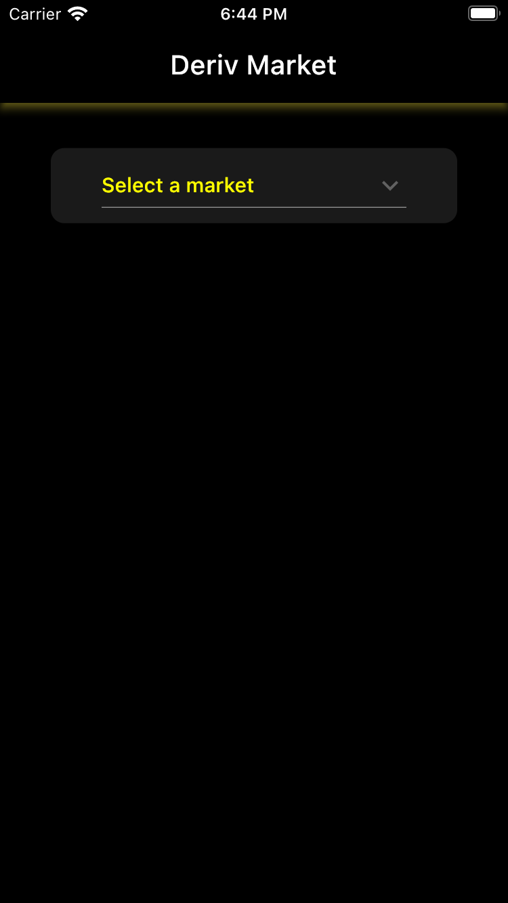
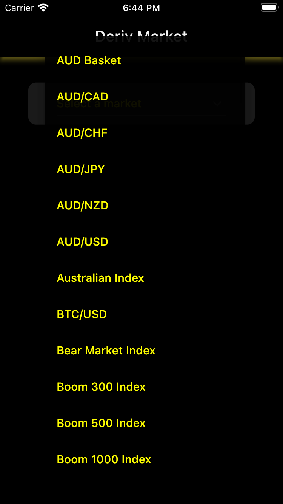
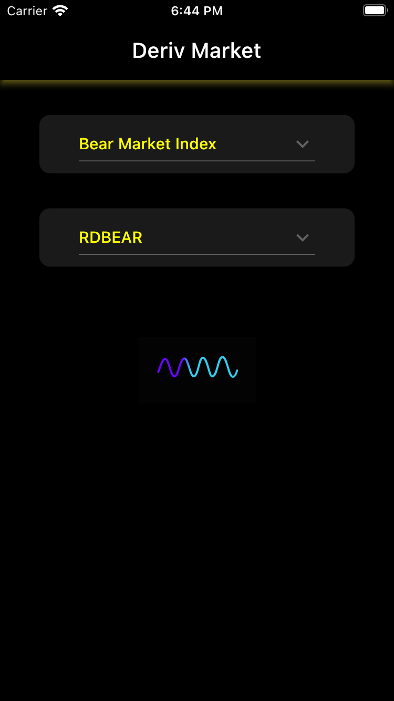
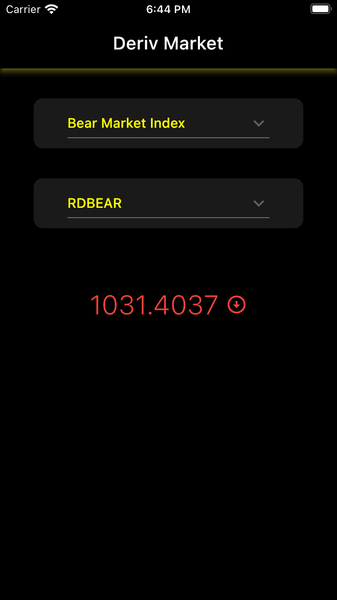
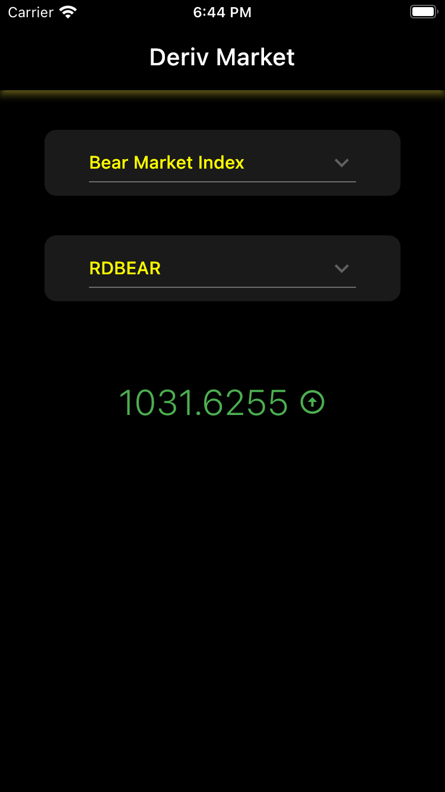
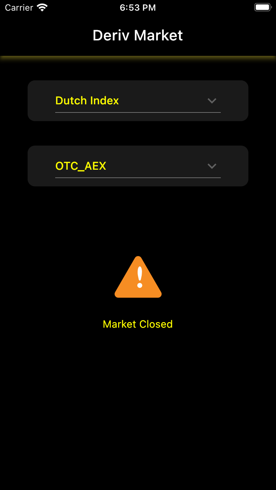

# PRICE TRACKER APPLICATION
Flutter live market price tracker application using Mobx state management and websocket for live market value

---

## Libraries used
- MOBX
- GETIT
- WEBSOCKETCHANNEL
- LOTTIE

---

## Screenshots

 
 

 
 

 
 
